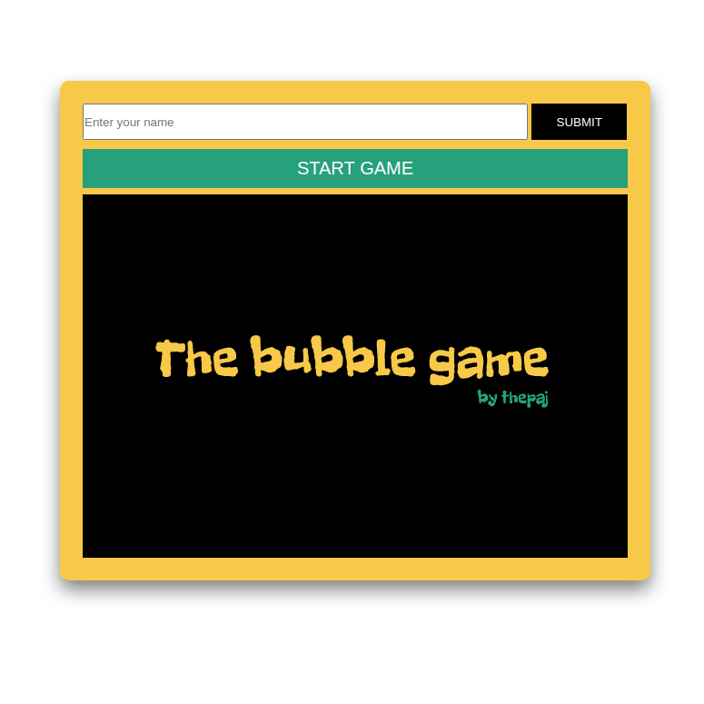
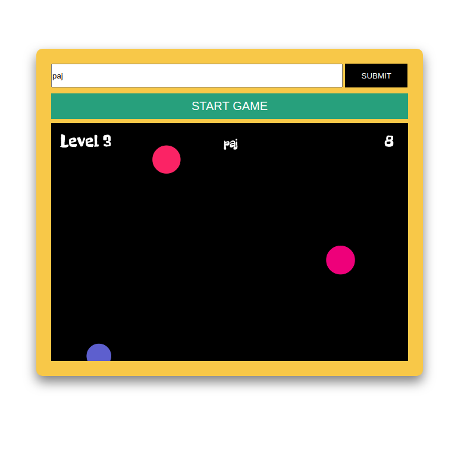

# thebubblegame

A web game build with P5.js.
The player has to click on bubbles to make them disapper before the time
runs out. While the levels are progressing more bubbles are appearing
and they are moving faster.

Leaderboard list is also implemented using firebase storage.

## Overview

First view before the game starts

Game playing

Game over

